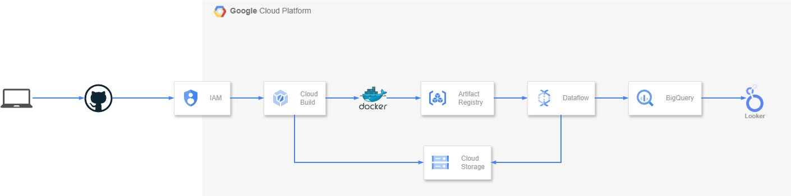
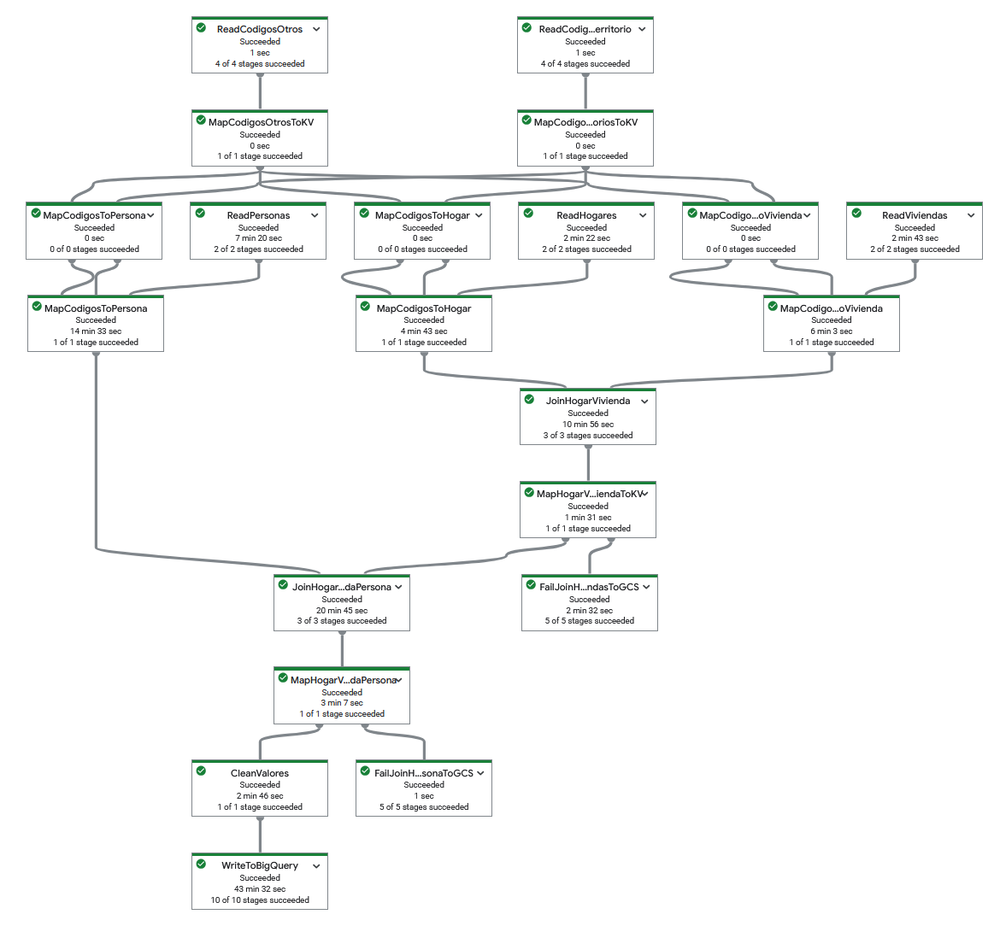
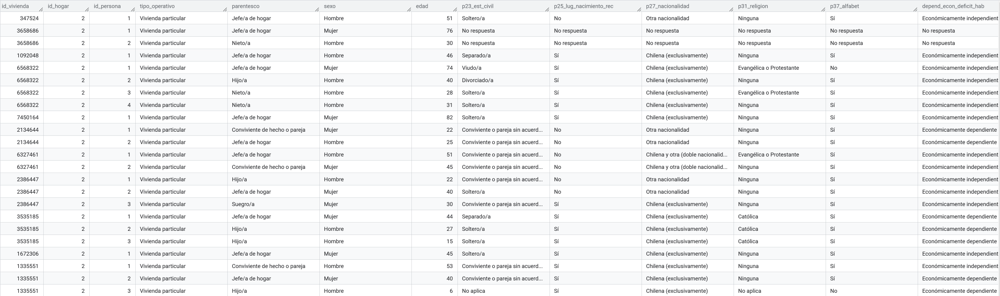
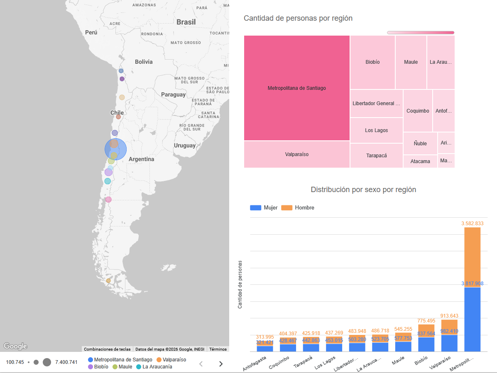
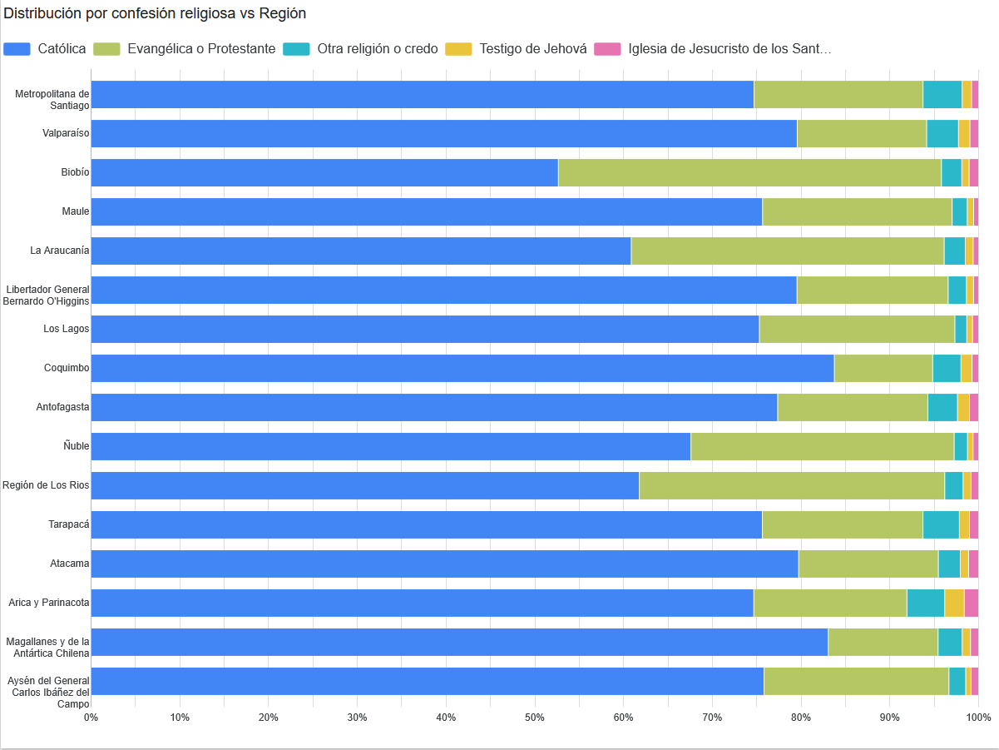

# 🇨🇱 Proyecto ETL Censo 2024 de Chile en GCP


## 📌 Descripción del Proyecto

Este proyecto implementa un pipeline ETL (Extracción, Transformación y Carga) robusto y escalable para procesar los datos oficiales del Censo de Población y Vivienda 2024 de Chile.

Construido sobre **Google Cloud Platform (GCP)**, el pipeline utiliza **Apache Beam** (ejecutado en **Cloud Dataflow**) para transformar datos crudos en formato Parquet y cargarlos en **BigQuery** mediante un esquema denormalizado y anidado, optimizado para el análisis de datos masivos. La visualización final de los resultados se realiza a través de **Looker Studio**.

> **Nota:** Los datos fuente fueron obtenidos desde el portal oficial [Resultados Censo 2024 INE](https://censo2024.ine.gob.cl/resultados/). Para optimizar el procesamiento en entornos locales o de prueba, el script `main.py` permite aplicar filtros iniciales que reducen el volumen de registros.

---

## 🏗️ Arquitectura del Pipeline

El diseño del pipeline sigue las mejores prácticas para procesamiento de grandes volúmenes de datos en la nube, incluyendo un flujo completo de integración y despliegue continuo (CI/CD) mediante **Cloud Build**.



### Modelado de Datos (BigQuery)

Para optimizar las consultas analíticas sobre los más de **18.4 millones de registros** resultantes, se implementó un modelo **denormalizado**. La unidad base (registro principal) es la **Persona**, mientras que los datos correspondientes a su `ubicación`, `hogar` y `vivienda` se integran como campos anidados (_nested records_). Este enfoque reduce significativamente la necesidad de realizar operaciones `JOIN` costosas, mejorando considerablemente el rendimiento y costos de las consultas.

---

## 🚀 Guía de Despliegue en GCP

Sigue los pasos a continuación para replicar la infraestructura y ejecución en tu propio entorno de Google Cloud.

### 1. Configuración Inicial

Define las variables de entorno necesarias para tu proyecto:

```bash
export PROJECT_ID="etl-censo"
export REGION="us-central1"
export PROJECT_NUMBER=$(gcloud projects describe $PROJECT_ID --format="value(projectNumber)")
export BQ_DATASET="ds_censo"
export BQ_TABLE="tbl_censo"

gcloud config set project $PROJECT_ID
```

### 2. Habilitar APIs de GCP

Habilita los servicios requeridos para la ejecución del pipeline:

```bash
gcloud services enable \
    artifactregistry.googleapis.com \
    cloudbuild.googleapis.com \
    compute.googleapis.com \
    storage.googleapis.com \
    secretmanager.googleapis.com \
    dataflow.googleapis.com
```

### 3. Configuración de Cloud Storage (Data Lake)

Crea el bucket y la estructura de directorios requerida por Dataflow:

```bash
BUCKET_NAME="etl-censo-df"

gcloud storage buckets create gs://${BUCKET_NAME} \
    --location=$REGION \
    --uniform-bucket-level-access \
    --enable-hierarchical-namespace \
    --clear-soft-delete

# Crear estructura de directorios
gcloud storage folders create gs://${BUCKET_NAME}/input
gcloud storage folders create gs://${BUCKET_NAME}/out
gcloud storage folders create --recursive gs://${BUCKET_NAME}/temp/staging
gcloud storage folders create gs://${BUCKET_NAME}/templates

# Listar los directorios para validar su creación
gcloud storage folders list gs://${BUCKET_NAME}/
```

> **Archivos de Entrada:** Asegúrate de subir los archivos fuente (`censo_schema.json`, archivos `.csv` y los 3 archivos `.parquet`) al directorio `gs://${BUCKET_NAME}/input/`.

### 4. Artifact Registry

Crea un repositorio para almacenar la imagen Docker del Dataflow Flex Template:

```bash
gcloud artifacts repositories create censo-artifact-repo \
    --repository-format=docker \
    --location=$REGION \
    --description="Repositorio Censo 2024" \
    --disable-vulnerability-scanning
```

### 5. Gestión de Permisos (Service Accounts)

Implementando el principio de menor privilegio, se requieren dos cuentas de servicio con roles específicos.

<details>
<summary><b>Ver configuración detallada de permisos (Click para expandir)</b></summary>

**Cuenta de servicio para Cloud Build:**

```bash
gcloud iam service-accounts create cloudbuild-app-sa \
  --description="Cuenta de servicio para CloudBuild"

SA_EMAIL_CB="cloudbuild-app-sa@${PROJECT_ID}.iam.gserviceaccount.com"

gcloud projects add-iam-policy-binding $PROJECT_ID --member="serviceAccount:${SA_EMAIL_CB}" --role="roles/storage.admin"
gcloud projects add-iam-policy-binding $PROJECT_ID --member="serviceAccount:${SA_EMAIL_CB}" --role="roles/cloudbuild.builds.editor"
gcloud projects add-iam-policy-binding $PROJECT_ID --member="serviceAccount:${SA_EMAIL_CB}" --role="roles/artifactregistry.writer"
gcloud projects add-iam-policy-binding $PROJECT_ID --member="serviceAccount:${SA_EMAIL_CB}" --role="roles/storage.objectAdmin"
gcloud projects add-iam-policy-binding $PROJECT_ID --member="serviceAccount:${SA_EMAIL_CB}" --role="roles/storage.objectViewer"
gcloud projects add-iam-policy-binding $PROJECT_ID --member="serviceAccount:${SA_EMAIL_CB}" --role="roles/logging.logWriter"
gcloud projects add-iam-policy-binding $PROJECT_ID --member="serviceAccount:${SA_EMAIL_CB}" --role="roles/dataflow.admin"
gcloud projects add-iam-policy-binding $PROJECT_ID --member="serviceAccount:${SA_EMAIL_CB}" --role="roles/iam.serviceAccountUser"
```

**Cuenta de servicio para Dataflow Workers:**

```bash
gcloud iam service-accounts create dataflow-app-sa \
  --description="Cuenta de servicio para Dataflow"

SA_EMAIL_AF="dataflow-app-sa@${PROJECT_ID}.iam.gserviceaccount.com"

gcloud projects add-iam-policy-binding $PROJECT_ID --member="serviceAccount:${SA_EMAIL_AF}" --role="roles/storage.objectUser"
gcloud projects add-iam-policy-binding $PROJECT_ID --member="serviceAccount:${SA_EMAIL_AF}" --role="roles/bigquery.user"
gcloud projects add-iam-policy-binding $PROJECT_ID --member="serviceAccount:${SA_EMAIL_AF}" --role="roles/logging.logWriter"
gcloud projects add-iam-policy-binding $PROJECT_ID --member="serviceAccount:${SA_EMAIL_AF}" --role="roles/dataflow.admin"
gcloud projects add-iam-policy-binding $PROJECT_ID --member="serviceAccount:${SA_EMAIL_AF}" --role="roles/dataflow.serviceAgent"
gcloud projects add-iam-policy-binding $PROJECT_ID --member="serviceAccount:${SA_EMAIL_AF}" --role="roles/monitoring.metricWriter"
gcloud projects add-iam-policy-binding $PROJECT_ID --member="serviceAccount:${SA_EMAIL_AF}" --role="roles/artifactregistry.writer"
gcloud projects add-iam-policy-binding $PROJECT_ID --member="serviceAccount:${SA_EMAIL_AF}" --role="roles/bigquery.jobUser"
```

</details>

### 6. Configuración de BigQuery (Data Warehouse)

Creación del dataset y la tabla con agrupamiento (clustering) para optimizar consultas futuras:

```bash
bq mk --dataset --location=$REGION $PROJECT_ID:$BQ_DATASET

bq mk --table \
  --clustering_fields=sexo,edad,p23_est_civil \
  --description="Tabla denormalizada con datos integrados del Censo 2024" \
  --schema=./censo_schema.json \
  $PROJECT_ID:$BQ_DATASET.$BQ_TABLE
```

### 7. CI/CD: Trigger de Cloud Build

Configura un trigger para automatizar el despliegue al realizar un `push` a la rama seleccionada:

> **Nota sobre el Repositorio:** El valor de `--repository` dependerá de si enlazaste tu GitHub a GCP de manera generada o manual. Asegúrate de colocar el ID correcto generado en tu consola.

```bash
# Asumiendo que la conexión ya se realizó
GIT_CONN="github-connection"
GIT_REPO="etl_censo_gcp"

gcloud builds triggers create github \
  --name="censo-trigger" \
  --repository="projects/${PROJECT_ID}/locations/${REGION}/connections/${GIT_CONN}/repositories/ericmartinezr-${GIT_REPO}" \
  --branch-pattern="^master$" \
  --build-config="cloudbuild.yaml" \
  --region=${REGION} \
  --service-account="projects/${PROJECT_ID}/serviceAccounts/${SA_EMAIL_CB}"
```

---

## ⚙️ Ejecución y Pruebas

### Ejecución en GCP (Dataflow Flex Template)

Puedes activar el pipeline subiendo un cambio a tu repositorio (vía Cloud Build) o manualmente desde Cloud Shell:

```bash
gcloud dataflow flex-template run etl-censo-job-01 \
  --template-file-gcs-location gs://etl-censo-df/templates/censo-pipeline.json \
  --region us-central1 \
  --worker-region us-central1 \
  --launcher-machine-type e2-standard-2 \
  --worker-machine-type e2-standard-2 \
  --parameters project=etl-censo,region=us-central1,dataset=ds_censo,table=tbl_censo,input_location=gs://etl-censo-df/input,staging_location=gs://etl-censo-df/temp/staging,output_location=gs://etl-censo-df/out,job_name=etl-censo-job-01,service_account_email=dataflow-app-sa@etl-censo.iam.gserviceaccount.com
```

> **Ver Estado:** Para consultar el estado de un job en BigQuery: `bq show --location=us-central1 -job ${PROJECT_ID}:<BIGQUERY_JOB_NAME>`

### Ejecución Local

Para desarrollo, puedes ejecutar el pipeline localmente utilizando el script proporcionado (asegúrate de tener tus credenciales y dependencias configuradas):

```bash
./run_dataflow.sh
```

### Pruebas Unitarias (Testing)

El proyecto incluye tests unitarios para garantizar la calidad del código y la correcta transformación de los datos:

```bash
python -m unittest -v ./tests/test_gcp.py
```

---

## 📊 Resultados Visuales

### DAG en Dataflow

El grafo de ejecución muestra una arquitectura limpia, procesando múltiples fuentes de datos en paralelo.



### Almacenamiento en BigQuery

Los datos se integran exitosamente aplicando el modelo denormalizado, utilizando esquemas anidados para facilitar la estructura y lectura.



### Dashboards en Looker Studio

Visualización de las métricas clave extraídas del Censo, demostrando la capacidad del pipeline para alimentar herramientas de Business Intelligence.


<br>


---

## 📚 Referencias Oficiales

- [BigQuery: Tablas Particionadas](https://docs.cloud.google.com/bigquery/docs/partitioned-tables) y [Clusteadas](https://docs.cloud.google.com/bigquery/docs/clustered-tables)
- [BigQuery: Registros Anidados y Repetidos](https://docs.cloud.google.com/bigquery/docs/nested-repeated)
- [BigQuery: Arquitectura Capacitor](https://cloud.google.com/blog/products/bigquery/inside-capacitor-bigquerys-next-generation-columnar-storage-format)
- [Dataflow: Configuración Flex Templates](https://docs.cloud.google.com/dataflow/docs/guides/templates/configuring-flex-templates#python)
- [Apache Beam: Testing de Pipelines](https://beam.apache.org/documentation/pipelines/test-your-pipeline/)
- [Seguridad y Permisos GCP](https://docs.cloud.google.com/dataflow/docs/concepts/security-and-permissions)

---

_Nota: Esta documentación ha sido escrita manualmente y refinada con asistencia de Inteligencia Artificial para garantizar claridad, precisión técnica y cumplir con estándares profesionales de la industria._
